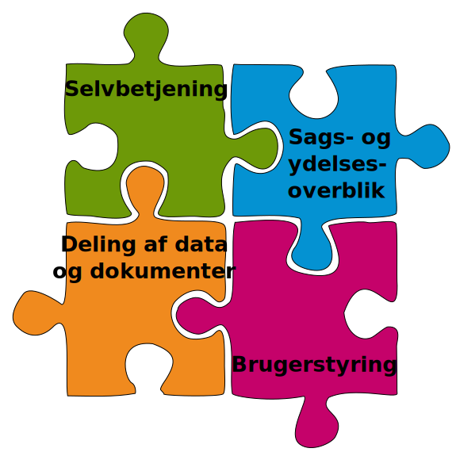

# Introduktion til Fællesoffentlig Rammearkitektur
V.1.0

## Forord

I forbindelse med godkendelsen af hvidbogen om fællesoffentlig digital arkitektur i maj 2017 blev det aftalt, at der skal etableres en fællesoffentlig rammearkitektur i regi af den fællesoffentlige digitaliseringsstrategi 2016-2020. 

Formålet er at understøtte sammenhængende digitale services, datadeling og tværgående samarbejde og rammearkitekturen skal være et redskab til gode arkitekturvalg. Den skal fungere som et fælles sprog og skabe overblik over den fælles base af standarder, specifikationer og komponenter. 

Formålet med denne introduktion er at give en indføring i grundkoncepterne i forhold til den fællesoffentlige rammearkitektur, således at læseren har en overordnet forståelse af formål, centrale begreber, anvendelse, processer og øvrige rammer for styring og anvendelse af rammearkitekturens forskellige elementer. 

Den primære målgruppe er forretnings- og it-arkitekter, projektledere og beslutningstagere i relation til projekter, som skal anvende rammearkitekturen som en integreret del af deres arbejde i forbindelse med offentlig digitalisering. 

Rammearkitekturen er underlagt styring af styregruppen for data og arkitektur. Projekterne i digitaliseringsstrategien skal følge de fællesoffentligt aftalte krav til anvendelse og underlægges arkitekturreview. 

Denne introduktion svarer i fem kapitler på disse fem hovedspørgsmål:

* **Hvad skal styregruppe, projektleder og arkitekt være opmærksomme på?**
* **Hvilke begreber og termer skal man kende for at forstå brugen af FDA?**
* **Hvad er indholdet i FDA Rammearkitektur?**
* **Hvad er det strategiske sigte med FDA og hvordan er vejen til realisering?**
* **Hvordan styres arkitekturen i spændet mellem løsning og FDA Rammearkitektur?**

Denne introduktion til den fællesoffentlige rammearkitektur forventes på baggrund af indhøstede erfaringer revideret omkring årsskiftet 2018/19.

## Introduktion

Dette dokument giver en introduktion til den fællesoffentlige rammearkitektur (_FDA Rammearkitektur)_ og henvender sig til forretnings- og it-arkitekter, projektledere og beslutningstagere i relation til projekter. 

Den fællesoffentlige rammearkitektur er et fælles redskab til at støtte digitaliseringsprojekter i udviklingen af organisations- og løsningsspecifikke arkitekturer, som kan hænge sammen på tværs. Den er en fællesoffentligt aftalt tilgang til levering af offentlige forretnings- og it-services på en måde, så disse kan virke sammen.

Scopet for FDA Rammearkitektur er defineret ved det til enhver tid gældende indhold, som er godkendt af styregruppen for data og arkitektur, som værende del af rammearkitekturen. Et samlet overblik vil blive publiceret og opdateret løbende på FDA’s hjemmeside [arkitektur.digst.dk](https://arkitektur.digst.dk/)[.](https://arkitektur.digst.dk/) 

Dokumentet skal anvendes i forbindelse med projekter i regi af den fællesoffentlige digitaliseringsstrategi. Dokumentet opdateres i takt med, at der gøres erfaringer med arbejdet med FDA Rammearkitektur. 

Sekretariatet for initiativ 8.1 tilbyder sparring og rådgivning til relevante projekter, og alle projekter er velkomne til at kontakte sekretariatet på [arkitektur@digst.dk](mailto:arkitektur@digst.dk) med spørgsmål og ønsker til sparring.

## Formål

Den fællesoffentlige hvidbog om digital arkitektur er udtryk for en stærk vision, fælles mål og klare principper for, hvordan staten, kommunerne og regionerne i fællesskab vil skabe et sammenhængende digitalt Danmark. FDA Rammearkitektur er et vigtigt fælles skridt i realiseringen af dette med fokus på, hvor den enkelte myndighed kan bygge egne løsninger på et fælles fundament.

Rammearkitekturen skal derfor _understøtte en effektiv, sammenhængende og transparent service for borgere og virksomheder, som er målrettet den enkeltes behov samt en effektiv digital understøttelse af tværgående processer og deling og genbrug af data._

Sagt med andre ord skal FDA Rammearkitektur være et redskab til gode arkitekturvalg, der understøtter FODS initiativernes udvikling og drift af sammenhængende itløsninger. Rammearkitekturen skal skabe overblik over det fælles grundlag, der består af løsningsmønstre, standarder, specifikationer og komponenter, der med fordel kan anvendes og genbruges på tværs af den offentlige sektors mange forskellige typer af itløsninger. Rammearkitekturen kan således finde anvendelse i mange typer af løsninger – fra selvbetjeningsapplikationer over fagsystemer til infrastruktur. 

Nedenstående figur illustrerer, at rammearkitekturen både er styret af og understøtter fælles forretningsmål og sætter rammer for og understøtter udvikling af it-løsninger til fælles og lokale projekter, som er underlagt den fælles styringsramme.

*Figur 1 Rammearkitekturens rolle*

FDA Rammearkitektur udgør sammen med hvidbogens principper og arkitekturregler grundlaget for den arkitekturstyring, der udføres i regi af digitaliseringsstrategien. Dette er udgangspunkt for projekternes arkitekturarbejde og for review af projekternes arkitekturvalg. Heraf følger også, at det er behovene i FODS initiativerne, der er drivende i forhold til hvilke elementer, der skal indgå i rammearkitekturen.

## Anvendelse

Hvad skal styregruppe, projektleder og arkitekt være opmærksomme på?

I dette kapitel beskrives hvad styregruppe, projektlederen og arkitekten skal være opmærksomme på forhold til at anvende FDA rammearkitektur i et projekt.

FDA Rammearkitektur _skal_ anvendes af projekter under digitaliseringsstrategiens initiativer. Det gælder både projekter, der laver fælles infrastrukturløsning som digital post og projekter, der sætter rammer for sammenhængende løsninger på tværs af myndigheder, fx i form af en borgervendt flytteguide, der understøtter en sammenhængende brugerrejse på tværs af forskellige selvbetjeningsløsninger. Rammearkitekturen skal ligeledes anvendes af projekter, der fx skal lave foranalyser udpege/udvikle fælles standarder.

Krav og anbefalinger i forhold til rammearkitekturen gælder som hovedprincip, når der er tale om nyudvikling. Der kan derudover aftales nærmere om implementering i eksisterende løsninger efter aftale mellem de offentlige parter og evt. andre berørte parter. 

Rammearkitekturen _kan_ anvendes af offentlige myndigheder og digitaliseringsprojekter i øvrigt. Governance for overholdelse af kravene i løsninger, der ikke er omfattet af aftalerne i den fællesoffentlige digitaliseringsstrategi, skal således aftales i den konkrete kontekst af de relevante aktører.  

### Projekternes arkitekturarbejde

Projekter skal udarbejde relevant arkitekturbeskrivelse således, at projekter kan koordineres med henblik på at udvikle it-løsninger, der understøtter sikker og effektiv deling af data og tværgående processer.

I forlængelse af hvidbog om fællesoffentlig digital arkitektur udføres arkitekturarbejdet efter en fælles forståelse for dokumentation udmøntet i _retningslinjer for arkitekturdokumentation i digitaliseringsprojekter_. Disse retningslinjer supplerer dette dokument. Retningslinjerne kan findes på [Introduktion til retningslinjer for formidling og dokumentation af arkitektur i digitaliseringsprojekter](https://github.com/Faellesoffentlig-Digital-Arkitektur/Retningslinjer-for-formidling-og-dokumentation-af-arkitektur-i-digitaliseringsprojekter/blob/main/Retningslinjer%20for%20formidling%20og%20dokumentation%20af%20arkitektur%20i%20digitaliseringsprojekter.md)

Anvendelse af fælles retningslinjer for arkitekturarbejdet skal understøtte, at projekterne udvikler løsninger, der kan arbejde sammen, at projekternes arkitekturarbejde kan kvalitetssikres gennem peer-review samt at projekternes arkitekturarbejde kan koordineres og bidrage til en løbende udbygning af den fællesoffentlige digitale arkitektur.

I et projekt er det styregruppens og projektlederens ansvar, at de fælles retningslinjer følges. Projektlederen skal derfor være bekendt med krav til dokumentation, brug af FDA Rammearkitektur og proces for tværgående governance med henblik på kvalitetssikring og koordinering.

Det fællesoffentlige samarbejde om arkitektur tager udgangspunkt i relevante ISO standarder for arkitekturarbejdet. Standarden _ISO/IEC 42010 Systems and software engineering – Architecture description_ definerer, hvordan man laver arkitekturbeskrivelser. Dette omfatter fire centrale elementer:  

* **Arkitekturbeskrivelse** – Omfatter identifikation af interessenter og deres interesser, definition af perspektiver på arkitekturen, der adresserer disse samt visninger af disse perspektiver. Visninger baseres på en arkitekturmodel, som definerer elementerne i arkitekturen og deres relationer og sammenhænge. Endelig skal beskrivelsen omfatte rationale for beslutninger.
* **Arkitekturperspektiver** - Et sæt aftalte veldefinerede perspektiver på arkitekturen, som arkitekturdokumentationen skal tage udgangspunkt i og understøtte. Her tager det fællesoffentlige arkitekturarbejde udgangspunkt i otte perspektiver, som modsvarer hvidbogens otte principper: Styring, Strategi, Jura, Sikkerhed, Opgaver, Information, Applikation, Infrastruktur.
* **Arkitekturrammeværk** – Et arkitekturrammeværk etablerer en fælles praksis for at skabe, fortolke, analysere og anvende arkitekturbeskrivelser. Det fællesoffentlige samarbejde tager her ligesom EU’s tilsvarende arbejde udgangspunkt i TOGAF [\[1\]](#fodnoter), som overordnet rammeværk og Archimate som grundlæggende referencemodel, som er åbne standarder i regi af Open Group. Desuden bygges der på EIF og EIRA [\[2\]](#fodnoter), som definerer en række elementer, der bygger videre på TOGAF og Archimate.
* **Arkitekturbeskrivelsessprog** – Enhver form for udtryk, som anvendes til arkitekturbeskrivelser. I FDA sammenhæng anvendes især Archimate til overordnet beskrivelse af den samlede arkitektur, BPMN [\[3\]](#fodnoter) til at beskrive detaljerede arbejdsgange og UML [\[4\]](#fodnoter) til detaljeret beskrivelse af begreber, data, use cases mv. Archimate, BPMN og UML er formelle modelsprog, som skal sikre præcision, men kan være svære at forstå. Derfor kan de suppleres med mere enkle og letforståelige beskrivelser i tekst, billeder o.l.

Næste kapitel giver en introduktion til de centrale begreber i arkitekturarbejdet.

Tjeklisterne i nedenstående bokse kan hjælpe projekterne til at gøre det helt klart, hvilke opgaver der skal tænkes ind i projektet og hvor i projektplanen de hører til.

#### Styregruppens tjekliste

* Har projektet en plan for hvilke arkitekturprodukter, der skal leveres som led i projektet?
* Har projektet taget stilling til, hvilke dele af rammearkitekturen projektet skal anvende og eventuelt bidrage til?
* Har projektet sikret en bemanding med de fornødne arkitekturkompetencer?
* Har projektet aftalt arkitekturrådgivning og arkitekturreview med henblik på kvalitetssikring? 

#### Projektlederens tjekliste

* Afklar i dialog med din styregruppe hvilken arkitekturdokumentation, der skal udarbejdes i dit projekt og hvornår. Brug en arbejdsgruppe og arkitekt til støtte. 
* Benyt eventuelt muligheden for rådgivning fra sekretariatet for initiativ 8.1.
* Afklar hvilken dokumentation, der bør være i forbindelse med et eventuelt arkitekturreview i regi af styregruppen for data og arkitektur.
* Lav som en del af projektplanlægningen en overordnet plan for udarbejdelse af arkitekturdokumentation i de forskellige faser. Planen bør omfatte hvilke arkitekturvisninger, der skal udarbejdes og krav til format og kvalitet i projektets hovedfaser.
* Sørg for at kommunikere eventuelle bidrag fra dit projekt til den fællesoffentlige rammearkitektur

### Løsningsarkitektens brug af FDA Rammearkitektur

Når et projekt skal udvikle en ny it-løsning eller videreudvikle en eksisterende løsning, vil projektets løsningsarkitekt(er) kunne tage udgangspunkt i de centrale dele af FDA Rammearkitektur, som består af referencearkitekturer og byggeblokke, som beskrives nærmere nedenfor. Disse er beskrevet overordnet i notationssproget Archimate, så det er relativt nemt at få et samlet overblik. Der kan være supplerende vejledninger, som skal inddrages i forhold til konkrete byggeblokke eller dele af arkitekturen. Desuden kan der være vejledninger, der understøtter, hvordan byggeblokke bringes i spil i forhold til bestemte typer af løsninger.

Eksempel: En arkitekt skal hjælpe en myndighed, der skal anskaffe en selvbetjeningsløsning med integration til eksterne registre og til eget fagsystem og ESDH system. Her vil løsningsarkitekten fx skulle orientere sig i flere forskellige referencearkitekturer, fx vedrørende _Selvbetjening_, som beskriver en grundlæggende fælles arkitektur for selvbetjening med fokus på gode og tværgående brugerrejser, _Sag og ydelse_, der beskriver en arkitektur for at levere et tværoffentligt overblik til borger eller virksomhed over egne sager og ydelser, _Deling af data og dokumenter_, der beskriver en fælles tilgang til deling og genbrug af data, herunder modeller for integration mellem it-systemer samt _Brugerstyring_, der beskriver en tværgående arkitektur for håndtering af brugerrettigheder

Desuden skal løsningsarkitekten orientere sig om FDA Rammearkitektur indeholder konkrete løsningsbyggeblokke, der skal genbruges i form af fx:

* Begrebs- og datamodeller for de data, som skal udveksles og som kan danne grundlag for anvendelsesprofil til udarbejdelse af snitfladebeskrivelser
* Meddelelsesmodel for forsendelse af dokumenter, der sendes via digital post
* Protokoller for teknisk udveksling
* Teknisk specifikation af token til bruger-id og rettighedsstyring.

Løsningsarkitektens opgave er bl.a. at sætte FDA-byggeblokkene ind i egen kontekst og beskrive dette. Dette gøres ved at finde relevante arkitekturbyggeblokke i det fælles FDA-katalog over byggeblokke. 

*Figur 2 Arkitekten genbruger byggeblokke*

Når arkitekten har identificeret en FDA-arkitekturbyggeblok, tjekker arkitekten, om der i kataloget også peges på en konkret løsningsbyggeblok, og om der er formelle krav til, at den skal, bør eller kan anvendes. 

Nedenstående figur illustrerer med en række eksempler, at arkitekten kan finde byggeblokke indenfor alle arkitekturarbejdets hovedperspektiver.

*Figur 3 Genbrugelige løsningsbyggeblokke*  

Arkitekten argumenterer, hvor det er relevant, for valg og eventuelle behov for tilpasning eller videreudvikling, fx i form af profilering af eksisterende specifikationer. Byggeblokkataloget kan betragtes som fælles baseline og omfatter byggeblokke fra både Danmark og EU, og giver således arkitekten mulighed for at genbruge relevante dele af FDA Rammearkitekturens modeller med anvendelse af fælles modelleringssprog. Løsningsarkitekten kan hente relevante Archimate, UML eller BPMN modeller online og importere dem i eget værktøj, idet de overholder et åbent og standardiseret udvekslingsformat. Både byggeblokke og modeller findes via FDA-hjemmesiden.

#### Arkitektens tjekliste

* Lav en overordnet skitse over den samlede arkitektur i projektet – fokuser i første omgang på forretningsopgaver, forretningsobjekter og applikationskomponenter
* Orienter dig i relevante referencearkitekturer og løsningsskabeloner, hvor du dels finder de mål og principper, begreber og byggeblokke, som du skal tage stilling til om er relevante i dit projekt. Gennemgå relevante tjeklister i referencearkitekturer.
* Sørg for at orientere dig i hvilke referencearkitekturer, løsningsskabeloner og løsningsbyggeblokke, der er i pipeline i andre projekter, og som kan have betydning for dit projekt.
* Udarbejd dit projekts overordnede arkitekturmodel i Archimate med brug af arkitekturbyggeblokke fra FDA byggeblokkataloget.
* Identificer kandidater til konkrete løsningsbyggeblokke, som dit projekt kan genbruge og indarbejd dem i dit projekts arkitekturmodel. De kan både være danske og internationale, fx fra ISA2 og CEF Digital fra EU.
* Hav løbende fokus på at anvende fælles terminologi og begreber, som defineres som del af FDA og som findes i FDA-ordbogen og FDA-modelkataloget.

## Begreber

Hvilke begreber og termer skal man kende for at forstå brugen af FDA?

### De centrale begreber i arkitekturarbejdet

Arbejdet med FDA Rammearkitektur indebærer en fælles forståelse af og tilgang til arkitekturarbejdet. Dette afsnit giver en kort introduktion til de centrale begreber i forhold til arbejdet med at udvikle og anvende FDA Rammearkitektur. Ud over de begreber, der beskrives her, indeholder den samlede FDA rammearkitektur et stadigt voksende fælles sprog i kraft af de begreber, der fastlægges i arbejdet med referencearkitektur og løsningsarkitektur, herunder særligt arbejdet med fælles begrebs- og datamodeller samt fælles referencedata.

De fleste af nedenstående begrebsdefinitioner er hentet fra enten ISO standarder eller Open Groups arkitekturrammeværk TOGAF. Du kan finde de formelle definitioner og begrebsmodeller på FDA hjemmesiden. De centrale begreber er fremhævet med fed.

**FDA Rammearkitektur** er en fællesoffentligt aftalt tilgang til levering af offentlige forretnings/ og it/services på en måde, så de hænger sammen.

**Arkitektur** er de fundamentale begreber og egenskaber ved et eller flere systemer i det miljø, de virker i, legemliggjort i systemets elementer, relationer og principper for dets udvikling (ISO/IEC/IEEE 42010). 

**Et system** er en kombination af interagerende elementer, der er organiseret for at opnå et eller flere erklærende formål. Et system er i denne sammenhæng menneskeskabt og kan konfigureres med ikke bare hardware og software og data, men også med mennesker, processer, procedurer, faciliteter og materialer og naturlige enheder (jf. ISO/IEC 15288). Arkitekturen kan vedrøre et enkelt system eller et system af systemer. Alt dette kan altså være genstandsfelt for arkitekturarbejdet. **Et it-system** er en samling af it-ressourcer, der leverer tjenester gennem en eller flere snitflader (jf. ISO/IEC TR 10000-1).

Scopet for FDA Rammearkitektur er grundlæggende enterprisearkitektur eller virksomhedsarkitektur, som omfatter både forretnings- og it-arkitektur. 

**Virksomhed** (enterprise) anvendes her i den forstand, som det er defineret i TOGAF: Enhver samling af organisationer, som har et fælles sæt af mål og/eller en fælles bundlinje. Det fællesoffentlige samarbejde er således at betragte som en fælles virksomhed (enterprise) i denne sammenhæng.

FDA Rammearkitektur har fokus på tværorganisatorisk interoperabilitet ligesom Det fælleseuropæiske rammearkitekturarbejde (EIF/EIRA). Det vil sige fokus på, hvordan de enkelte systemer virker sammen som et digitalt økosystem af services. **Interoperabilitet** er i denne sammenhæng evnen til at dele informationer gennem sammenhængende services, dvs. forretningsservices understøttet af it-services.  

#### Analogi til byplan og byggevejledning

Grundet det meget brede scope kan FDA rammearkitektur helt overordnet sammenlignes med en byplan og byggevejledning, som udstikker nogle overordnede retningslinjer for, hvordan en by skal udvikles og som stiller krav til den fælles infrastruktur i form af fx veje og brandvæsen og til de enkelte bygningers indretning med hensyn til adgangsveje og sikkerhed såvel som krav til de transportmidler, der må anvendes i byens transportveje. 

FDA rammearkitektur har mange **interessenter** med **interesser** (også kaldet stakeholder concerns) i forhold til løsningers (systemers) arkitektur.  Interessenter omfatter myndigheder (stat, regioner, kommuner) såvel som borgere og virksomheder samt hvor det er relevant leverandører og udenlandske aktører som fx EU. 

En **løsning** er et svar på et problem som adresserer interessenters interesser. En del af dette er i forbindelse med digitalisering en teknisk løsning i form af et it-system, men en løsning kan indeholde meget andet end it. En **it-løsning** er opfyldelse af et system- eller forretningsbehov, der involverer it som middel til opfyldelse af behovet 

Arkitektur beskrives som modeller. **En model** er en repræsentation af et emne af interesse. Den centrale del af arkitekturarbejdet, det logiske arbejde, kan beskrives som modellering og en arkitektur som en arkitekturmodel. En rammearkitektur eller en løsningsarkitektur kan betragtes som en overordnet **arkitekturmodel**, som kan opdeles i segmenter og repræsenteres på forskellige måder. 

En repræsentation af en del af arkitekturen kaldes en **visning** (view), som udarbejdes i henhold til et veldefineret **perspektiv** (viewpoint), der repræsenterer relevante interessenters behov for viden om systemet. FDA Rammearkitektur følger hvidbogens otte principper og beskrives helhedsorienteret gennem otte grundlæggende perspektiver på interoperabilitet, som understøtter principperne. 

De otte grundlæggende perspektiver er: Styring, Strategi, Jura, Sikkerhed, Opgaver, Information, Applikation og Infrastruktur. Disse udgør en fælles grundstruktur i en helhedsorienteret dokumentation. Hvert perspektiv kræver særlig opmærksomhed, når en ny offentlig service skal udvikles, populært sagt: Fra lov til løsning. De tre perspektiver Styring, Strategi og Sikkerhed går på tværs af de fem øvrige perspektiver. I denne sammenhæng er der særligt fokus på interoperabilitet, og vi kan derfor også kalde disse for interoperabilitetsperspektiver. Arkitekturvisninger kan tage udgangspunkt i disse og vise relevante elementer og relationer indenfor et eller på tværs af flere af disse perspektiver. De grundlæggende FDA-perspektiver kan relativt let mappes til tilsvarende i fx andre arkitekturrammer som EIF/EIRA og TOGAF og Archimate. 

FDA Rammearkitektur udfoldes gennem en række referencearkitekturer. En **referencearkitektur** beskriver, hvordan løsninger skal bygges indenfor et specifikt område med henblik på at flere anvender samme arkitektur. Referencearkitekturerne beskriver vision, mål og principper og udpeger de vigtigste arkitekturbyggeblokke og kan anvendes til at pege på løsningsbyggeblokke og områder for fælles standarder og fælles løsninger, herunder særligt fælles infrastrukturkomponenter. 

**En byggeblok** repræsenterer en (potentielt genanvendelig) del af en forretnings-, IT- eller arkitektonisk kapabilitet, der kan kombineres med andre byggeblokke til at levere løsninger. En byggeblok kan således have forskelligt niveau af kompleksitet (simpel vs. sammensat byggeblok). En **arkitekturbyggeblok** (ABB) er en delmængde af arkitekturmodellen, som beskriver et enkelt aspekt af den overordnede model. Hver af disse er der logisk set kun én af. En **løsningsbyggeblok** (LBB) er en foreslået løsning, der opfylder en arkitekturbyggebloks specifikation. Der kan være flere løsningsbyggeblokke, der kan realisere en arkitekturbyggeblok.

FDA tager udgangspunkt i TOGAF’s defintion af en byggeblok, men anvender som EIRA en bred fortolkning, således at byggeblokke kan være indenfor alle perspektiver på arkitekturen. Fx definerer EIRA/FDA et _lovgivningskatalog_ og en _identitetsstyringsservice_ som abstrakte arkitekturbyggeblokke, som modsvares af _Retsinformation_ og _NemID/MitID_ som genbrugelige danske løsningsbyggeblokke. 

Til støtte for udvikling af specifikke typer af løsninger kan der udvikles løsningsarkitekturskabeloner. En **løsningsarkitekturskabelon** er en skabelon, som peger på en række arkitektur- og løsningsbyggeblokke i relation til en afgrænset type løsninger, og kan anvendes som grundlag for løsningsarkitektur. 

**Løsningsarkitektur** er en beskrivelse af en bestemt forretningsaktivitet, og hvordan it understøtter denne aktivitet. En løsningsarkitektur omfatter typisk et enkelt projekt. Den støtter oversættelsen af krav til detaljerede specifikationer af krav til forretningens opgaveløsning og it-systemets egenskaber. Den understøtter ligeledes planlægningen af en portefølje af implementeringsopgaver. 

Arkitektur og arkitekturdokumentationen har ligesom systemer og løsninger et ”liv” og en tilstand over tid. En arkitekturmodel kan således beskrive en tilstand på et givent tidspunkt: En **nuværende arkitektur**, der beskriver arkitekturens nuværende tilstand, en **målarkitektur**, som beskriver en fremtidig tilstand og en **transitionsarkitektur**, der beskriver arkitekturens tilstand på et arkitektonisk betydningsfuldt tidspunkt. En eller flere transitionsarkitekturer kan bruges til at beskrive udviklingen (migrationen) over tid fra nuværende arkitektur til målarkitektur. Hvis målarkitekturen er beskrevet meget overordnet og abstrakt kaldes den også en vision eller et målbillede.

En løsning kan i praksis være omfattet af målarkitektur på flere niveauer og i flere kontekster. Udover den grundlæggende målarkitektur for løsningen i sig selv, kan den fx indgå som del af en samlet målarkitektur på virksomhedsarkitektur niveau for en myndighed, et fagdomæne, fællesoffentligt eller fælleseuropæisk. Indenfor konteksten af FDA Rammearkitektur er en løsning typisk en interoperabel it-løsning, der understøtter deling af information mellem offentlige myndigheder, med borgere og virksomheder og på tværs af landegrænser. Det stiller særlige krav til arkitekturarbejdet.

### Grundstruktur i FDA Rammearkitekturen

Det er vigtigt for projekterne at kunne identificere hvilke fælles arkitektur og løsningsbyggeblokke, der findes og at kunne orientere sig i deres rolle i den samlede arkitektur. Derfor arbejdes der i FDA Rammearkitektur med to grundlæggende, samvirkende koncepter for struktur for byggeblokkene, der tager udgangspunkt i den begrebsmodel interoperabilitetsstyring og styring af integrerede offentlige tjenester, som er beskrevet i det fælleseuropæiske rammeværk for interoperabilitet (EIF), jf. nedenstående figur.

*Figur 4 EIF begrebsmodel*

Venstre del af modellen, interoperabilitetsstyring, omfatter fire niveauer for interoperabilitet: Juridisk, Organisatorisk, Semantisk og Teknisk og den tværgående styring.

Højre del af modellen, styring af integrerede offentlige tjenester, består af seks hovedområder:

* Aktører, der omfatter brugerne og de roller, som de kan tildeles
* Adgang og integrerede offentlige services, der er de tjenester inkl. brugergrænsefladen, som disse kan anvende
* Koordinering og integration af servicelevering, som er det mellemlag, der søger for at sætte indholdet sammen til understøttelse af den enkeltes aktuelle opgave
* Kataloger, som er en støtte til koordinering og integration, hvor der deles information om, fx hvor kildedata findes og er modelleret
* Datakilde og grundlæggende services er det lag, hvorfra tjenesterne henter de data, som præsenteres for brugeren og til fx at foretage beregninger
* Sikkerhed og privatliv, som går på tværs af de øvrige områder med henblik på at understøtte tværgående sikkerhed og privacy.

Højre del af modellen kaldes også model over det digitale økosystem eller populært ”spillepladen”.

I FDA sammenhæng anvendes EIF-modellen i en lettere tilpasset form baseret på hvidbogens principper og de otte hovedperspektiver på arkitekturen, jf. nedenstående figur, der også viser, hvordan de otte FDA-perspektiver mappes til EIF. 

*Figur 5 FDA profil af EIF begrebsmodel*

## Indhold

Hvad er indholdet i FDA Rammearkitektur?

FDA Rammearkitektur kan betragtes som en samling af vejledninger om, hvordan man bygger digitale løsninger med fokus på alle de relevante aspekter fra strategiske mål for opgaveløsning til teknisk løsning.  

### Referencearkitekturer

På overordnet niveau består rammearkitekturen af en række referencearkitekturer, som giver en fælles fortælling om, hvordan man laver digitale løsninger i form af principper, sprog og løsningsmønstre i forbindelse med digitalisering. På et detaljeret niveau består rammearkitekturen af byggeblokke i form af fx specifikationer og standarder og kan pege på løsninger og komponenter, der konkret udmønter dele af rammearkitekturen. Fx er MitID og NemLogin løsninger, der kan anvendes til at efterleve referencearkitektur for brugerstyring. 

*Figur 6 De første FDA reference-arkitekturer*

Den første version af den fællesoffentlige rammearkitektur bygges op omkring referencearkitekturer, som behandler væsentlige emner og problemstillin-

ger, som har bredt ophæng i digitaliseringsstrategiens initiativer. Der er for nuværende aftalt fire referencearkitekturer ud fra behovene i FODS projekter. Disse er enten under udvikling eller færdige og optaget i rammearkitekturen primo 2018: Selvbetjening,

Overblik over egne sager og ydelser, Deling af data og dokumenter samt Brugerstyring.

Desuden er der identificeret to kandidater, som pt. ikke er aftalt og planlagt: Tværgående processer og Robust og sikker infrastruktur. 

**Referencearkitektur for selvbetjening** har fokus på borgernes og virksomheders møde med de digitale services. Den skal bidrage til at gøre anvendelsen så nem og overskuelig som muligt for borgere og virksomheder og samtidig understøtte innovation og effektivisering i den offentlige opgaveløsning. 

**Referencearkitektur for overblik over egne sager og ydelser** har fokus på at skabe overblik for borgere og virksomheder vedrørende sagsbehandling og udbetaling af ydelser. Til forskel fra referencearkitekturen for selvbetjening er udgangspunktet ikke datafangst, men adgang til oplysninger og status på sager, ydelser og lignende.

**Referencearkitektur for tværgående processer** har fokus på, at processer på tværs af myndigheder såvel som mellem den offentlige og den private sektor skal kunne hænge sammen via udnyttelse af løse koblinger og deling af data. Til forskel fra referencearkitektur for selvbetjening omhandler denne også processer, der ikke indebærer selvbetjening, men fx samarbejde om administrativ sagsbehandling i flere myndigheder eller om patientbehandling på tværs af hospital og hjem.

**Referencearkitektur for deling af data og dokumenter** har til formål at vejlede i valget mellem mønstre for videregivelse af oplysninger, herunder anvendelse af udstillede data typisk via API i system-til-system-integrationer samt forsendelse af meddelelser indeholdende data, herunder dokumenter. 

**Referencearkitektur for brugerstyring** har fokus på styring af brugere og rettigheder på tværs af it-services i føderationer på grundlag af fælles sikkerhedsmodeller, standarder og infrastruktur.

**Referencearkitektur for sikker og robust drift** har fokus på sikker, robust og effektiv infrastruktur for driften af de it-services, der indgår på alle lag og områder i det fælles digitale økosystem, men med fokus på de centrale dele og på sikring mod kritiske nedbrud og kaskadeeffekter.

De enkelte referencearkitekturer er bedste bud på håndteringen af relevante udfordringer på det tidspunkt, hvor de laves. Men der sker hele tiden en udvikling og modning, og der indsamles løbende erfaringer, ligesom behovene ændrer sig. Den enkelte referencearkitektur forventes derfor at blive genstand for revision med henblik på fx at opdatere indholdet efterhånden, som der gøres erfaringer, nye behov opstår og nye områder modnes. Tilsvarende vil der kunne aftales yderligere emner for referencearkitekturer, som supplerer de seks områder, der allerede er identificeret. 

Det forventes ligeledes, at der på en række områder er mange, der skal anskaffe samme slags løsninger. Her vil man kunne udarbejde fælles løsningsarkitekturskabeloner, som er detaljerede retningslinjer for specifikke typer af løsninger. Disse kan udarbejdes på baggrund af relevante referencearkitekturer og uddybende specifikationer af byggeblokke samt andre regler, retningslinjer og vejledninger, som indgår i den fællesoffentlige digitale arkitektur. Fx regler for begrebs- og datamodellering og retningslinjer for webservices. 

### Byggeblokke

På baggrund af EIRA og FDA-referencearkitekturerne bygges et fællesoffentligt katalog over byggeblokke. 

EIRA definerer ca. 150 arkitekturbyggeblokke (EIRA version 2.0). På baggrund af arbejdet med de fire første referencearkitekturer er der defineret yderligere pt. cirka FDA 200 arkitekturbyggeblokke, som specialiseringer af de basale byggeblokke i EIRA. Der er cirka 350 arkitekturbyggeblokke fordelt på de otte FDA-arkitekturperspektiver, som kan tilgås på hjemmesiden for FDA (FDA version 0.5). 

Som beskrevet ovenfor kan byggeblokke kombineres og bestå af andre byggeblokke. Nedenstående figur viser et eksempel på en simpelt beskrevet byggeblok (til venstre) og en visning, hvor flere byggeblokke er sammensat til at give en mere detaljeret beskrivelse. Det kan man fx bruge til at definere fælles rammer for hvad der skal standardiseres og genbruges. 

De fælleskommunale byggeblokke har traditionelt haft fokus på sammensatte forretningsservices, der kan oversættes til applikationsservices. FDA anvender byggeblokbegrebet bredere, så de kan kombineres og opdeles fleksibelt og efter behov. Fx kan der være behov for hele den sammensatte byggeblok eller kun dele af den for at understøtte interoperabilitet i en konkret sammenhæng. Og de enkelte del-byggeblokke kan eventuelt genbruges i flere sammenhænge.

Personregistrering meget overord-net beskrevet med én byggeblok

Opgaven Personregistrering beskrevet med flere byggeblokke sat sammen

*Figur 7 Simpel byggeblok versus sammensat byggeblok*

Nedenstående figur er en visning, der mapper de vigtigste byggeblokke til den konceptuelle model for styring af offentlige integrerede services (spillepladen). Den giver et højniveau overblik over de vigtigste arkitekturbyggeblokke, som er identificeret i arbejdet med ovennævnte referencearkitekturer. Denne visning går på tværs af de otte hovedperspektiver og har fokus på byggeblokke, der vedrører hovedperspektiverne opgaver, information og applikation. Det bemærkes, at de basale EIRA byggeblokke ikke er synlige i denne visning.

*Figur 8 Eksempler på FDA byggeblokke vist (spilleplade-visning)*

## Strategi

Hvad er det strategiske sigte med FDA og hvordan er vejen til realisering?

Den fællesoffentlige digitaliseringsstrategi 2016-2020 fastslår, at den grundlæggende målsætning er: **_Det digitale skal være let, hurtigt og sikre god kvalitet._** 

Hvidbog om arkitektur for digitalisering fastlægger en vision for den fællesoffentlige digitale arkitektur: **_Den digitalt sammenhængende offentlige sektor._** _Den fælles arkitektur for digitalisering skal på sikker vis understøtte tværgående processer og effektiv deling af data på tværs af myndigheder samt mellem den offentlige og den private sektor. Målet er, at borgerne og virksomhederne oplever en service, der er effektiv, sammenhængende, transparent og målrettet den enkeltes behov samt understøtter innovation, vækst og udvikling i samfundet._

*Figur 9 Vision: brugergrænseflader og -rejser der hænger sammen*

Set med borgerens eller brugerens øjne kan denne vision ses som sammenhængende brugerrejser med konsistente brugergrænseflader, der er nemme at navigere i. 

Fælles arkitektur skal understøtte, at services kan leveres sammenhængende endto-end (back-end to front-end) på tværs af myndigheder og kanaler.

### Rammearkitekturens overordnede målbillede

Den fællesoffentlige rammearkitektur skal understøtte den overordnede målsætning og arkitekturvision og tager udgangspunkt i et målbillede, der fastlægger nogle grundlæggende egenskaber og dermed stiller nogle krav til arkitekturen i de løsninger, som udvikles i de forskellige projekter i digitaliseringsstrategien: _Det digitale økosystem understøtter sikkert og effektivt datadeling, løst koblede processer og automatisering end-to-end._  

Det digitale økosystem er de løsninger, som ved at følge fælles arkitektur og standarder kan fungere i samspil og dermed håndtere disse udfordringer. Det omfatter dels de mange løsninger hos den enkelte myndighed dels fælles løsninger i domænefællesskaber og endelig de fællesoffentlige løsninger, som skal fungere som infrastruktur på tværs af domæner. Hertil kommer i en række tilfælde at løsningerne skal kunne indgå i et større internationalt digitalt økosystem, primært i forhold til EU og det digitale indre marked. 

### Centrale udfordringer

To centrale udfordringer skal håndteres for at opnå de strategiske kapabiliteter i det digitale økosystem, som er beskrevet i ovenstående målsætning, vision og målbillede:

1. Problemet når man skal dele data på tværs af organisatoriske, faglige eller itsystem-domæner, hvor begreber, termer og data anvendes heterogent.
2. Problemet når man ønsker at skabe en løst koblet sammenhæng i processer på tværs af organisatoriske og it-systemmæssige skel. 

Det første problem vedrører evnen til at genbruge af master data og andre autoritative data fra kilden, herunder transaktionsdata fra fx sagsbehandlings og andre fagsystemer.  Det kræver, at der er overblik over hvilke data, der kan genbruges, hvordan de skal fortolkes (semantisk beskrivelse). Dvs. at det skal være nemt at udstille, tilgå og anvende data. Tiltag, som fx fællesoffentlige modelregler og kataloger over datasæt og datamodeller samt fælles integrationsmønstre og retningslinjer for webservices og fælles protokoller, skal understøtte dette.

Det andet problem vedrører evnen til at skabe løsninger, hvor borgere og virksomheder oplever sammenhæng i mødet med det offentlige. Dvs. når brugerrejser i forbindelse med digital selvbetjening eller forretningsprocesser i form af behandling, sagsbehandling og forvaltning går på tværs af myndigheder. En sammenhængende front-end kræver en sammenhæng i back-end. Derfor vil der være en række områder, hvor myndighedernes, og ofte også private aktørers, forretningssystemer kan kommunikere med hinanden i forhold til deres arbejdsgange.  Tiltag som fælles infrastruktur og standarder for meddelelser, beskeder og påmindelser skal understøtte dette. 

Det skal desuden være nemt at styre adgangen til data på en måde, der understøtter krav til privacy og sikkerhed, herunder muligheden for at slette distribuerede data. Næste generationer af fælles infrastrukturløsninger som MitID og NemLogin skal sammen med rammeværk og tekniske protokoller for brugerrettigheder understøtte dette på tværs af domæner. 

### Arkitekturtilgange

Arkitekturernes arbejde går på at finde den tilgang til håndtering af udfordringer, som giver de bedste løsninger, i denne sammenhæng under den grundlæggende forudsætning, at løsninger skal være interoperable. Nedenstående boks beskriver en række eksempler på forskellige arkitekturstile, tilgange og teknologier, som har forskellige styrker og svagheder og som kan supplere hinanden.

#### Forskellige tilgange til serviceorienteret løsningsarkitektur

**Serviceorienteret arkitektur** (SOA) giver principper for modulopbygning af løsninger og integration og datadeling via services. SOA er i sin grundform et mønster, hvor man spørger en given service og får svar (pull). SOA er gennem de sidste 15-20 år blevet mainstream. Services er bygget uden på siloløsninger og de fleste nye løsninger er skabt som SOA-løsninger. 

**Hændelsesdrevet arkitektur** (på engelsk eventdriven architecture - EDA) er en videreudbygning af SOA. EDA giver principper for publicering af og abonnement på besked om forretningshændelser. Dvs. et grundmønster, hvor man får besked fra en service, når der er nyt (push). Det understøtter datadeling ved, at man kan få besked, så snart data ændres. Nok så væsentligt understøtter det en (løs) kobling af processer og det er velegnet til at understøtte procesautomatisering. Hændelsesdrevet arkitektur er de sidste 3-5 år kommet i spil en række væsentlige steder i den offentlige sektor, bl.a. Den Digitale Tinglysning, Det Fælles Medicinkort og Den fælleskommunale rammearkitektur. Grunddataprogrammet har etableret et fælles beskedformat og en fælles beskedfordeler. 

**Linked Data** (LD) giver nogle principper og metoder for, hvordan data kan udstilles med semantisk opmærkning, så det er nemt at søge på tværs af mange it-systemer og at fortolke data både for mennesker og maskiner, selv om it-systemerne har hver sine datamodeller. Det giver meget fleksible muligheder for at dele og genbruge data. Linked Data er et centralt element i forhold til visionerne for det, der kaldes ”the semantic web”. Lindked Data rummer et meget stort potentiale, men nyder stadig kun begrænset udbredelse både i Danmark og internationalt, og der er stadig kun få leverandører på markedet. De fællesoffentlige modelregler på niveau 3 understøtter Linked Data. 

**Blockchain** er et eksempel på en ny tilgang, som både kan ses som et brud med og en videreudbygning af serviceorienteret arkitektur, som potentielt kan skabe nye infrastrukturelle rammer for, hvordan vi deler data og dokumenter på en måde, som er sikker, sporbar, gennemsigtig, med fuld historik og distribueret med høj grad af trust uden en centralt ansvarlig aktør. Blockchain er stadig en relativt umoden teknologi, hvor fokus i de senere år har været på Bitcoin og andre cryptocoins. I de senere år er nye initiativer dukket op med fokus på andre anvendelser, fx i forhold til deling af handels- og fragtdokumenter. Set i et 3-10 års perspektiv er Blockchain formentlig helt central at forholde sig til på en række områder som fx samtykke til datadeling og tværgående behandling af delte dokumenter.  

Disse forskellige tilgange behøver ikke at konflikte, men kan kombineres og bringes i anvendelse over tid. Det kræver, at de digitale løsninger overholder de grundlæggende principper for lagdeling og serviceorientering og at de er indrettet så fleksibelt, at de over tid kan bibringes nye egenskaber.

Grundlæggende skal it-løsninger understøtte en serviceorienteret arkitekturstil og kunne kommunikere ved hjælp af webservices. Øvrige principper og metoder bringes i anvendelse, hvor det er relevant og hvor det aftales som led i udviklingen af den fællesoffentlige rammearkitektur og infrastruktur.

### Vejen mod fælles mål

Nedenstående figur illustrerer et overordnet roadmap for, hvordan denne proces forventes at forløbe over de kommende år. Det er en vigtig pointe, at der er tale om en iterativ proces, hvor der hele tiden sker en læring og modning. Forretningsbehovene vil løbende flytte sig, både styret af politiske mål og brugerbehov. Og teknologien flytter sig til stadighed, således at nye muligheder opstår og gamle løsninger forældes.

*Figur 10 Roadmap for FDA rammearkitektur*

Vejen frem til målbilledet skal ske gennem en migrationsstrategi, hvor de offentlige itløsninger over tid tilføjes nye egenskaber eller bygges efter nye arkitekturprincipper i takt med markedsmodning og genudbud. Den fællesoffentlige rammearkitektur opbygges iterativ og i takt med identificerede forretningsbehov, udfordringer og modning. Adoption og anvendelse sker ved, at domænerne profilerer fælles standarder og udarbejder løsningskabeloner, hvor der er behov for dette. Det kan fx være i forhold til en flytteguide, der samler og sammenkæder relevante selvbetjeningsløsninger eller brugerstyring på tværs af forskellige sikkerhedsdomæner. Den enkelte myndighed skal, hvor det er relevant, sikre, at den fælles arkitektur understøttes ved anskaffelse af nye løsninger, hvor det aftales, ved tilpasning af eksisterende løsninger.

Nedenstående figur viser, hvordan der med udgangspunkt i den fællesoffentlige digitaliseringsstrategi og hvidbogen om fællesoffentlig digital arkitektur kan etableres sammenhængende løsninger.

*Figur 11 Fra strategi over arkitektur til løsninger*

I den øverste del er det de overordnede strategiske perspektiver, der er i spil. Her udpeges områder for fælles referencearkitektur og byggeblokke i form af standarder og infrastruktur. Eksempler på områder er selvbetjening, brugerstyring og deling af data og dokumenter. Det indledende arbejde for FDA Rammearkitektur består i at udarbejde en række referencearkitekturer, som fastlægger de vigtigste principper og et fælles sprog ved at udpege og definere arkitekturbyggeblokke. Figuren viser, hvordan der i forlængelse af dette kan gennemføres uddybende strategiske analyser, uddybning af arkitekturbyggeblokke samt vurdering af relevante standarder. Og endelig hvordan der på baggrund af dette kan fastlægges målbillede, der beskriver de ønskede kapabiliteter og de byggeblokke, der skal til for at opnå disse, samt en migrationsstrategi, der beskriver de overordnede skridt, som skal til i forhold til udvikling og ibrugtagning af byggeblokkene i alle de relevante løsninger. 

De strategiske beslutninger på ledelsesniveau danner grundlag for arkitekternes arbejde med udvikling af referencearkitekturer og arkitektur- og løsningsbyggeblokke, herunder fastlæggelse af fælles standarder og specifikation af krav til fælles infrastruktur. Det kan fx vedrøre fælles krav til datas egenskaber og snitflader samt anvendelse af særlige infrastrukturkomponenter som fx MitID. På dette niveau udformes en detaljeret plan, som understøtter strategien for realisering og migration.

På det nederste niveau er det leverandørerne (i praksis både kunden og den kommercielle leverandør), der går i gang med at designe og udvikle de konkrete løsningsbyggeblokke, ligesom når håndværkerne går i gang med at bygge et hus. Her kan en række fælles byggeblokke være en forudsætning for, at lokale løsninger kan udvikles. Når de fælles løsningsbyggeblokke i form af standarder og infrastruktur er på plads, er det fælles fundament lagt for udrulning i lokale løsninger hos den enkelte myndighed og ud til borgere og virksomheder.

## Styring

Hvordan styres arkitekturen i spændet mellem løsning og FDA Rammearkitektur?

### Arkitekturstyring på forskellige niveauer

I spændet mellem en rammearkitektur og konkret løsningsarkitektur, hvor der indgår mange forskellige interessenter og hvor målarkitekturen måske påvirker mange systemer, er det vigtigt at være enige om, hvilke dele af forretnings- og it-arkitekturen der løses på hvilket niveau, således at der er klarhed over ansvar og rollefordeling.

Scopet for en (mål)arkitektur kan i fællesoffentlig sammenhæng dække en enkelt løsning, fx et statsligt it-system eller fællesoffentlig infrastrukturløsning.  Det kan omvendt også være en flerhed af løsninger, fx dækkende en mængde selvbetjeningsløsninger, som leveres af forskellige myndigheder.  

Hvidbogen fastslår som overordnet princip, at arkitektur skal styres på rette niveau efter fælles rammer. Det dækker et spænd fra den lokale løsningsarkitektur, hvor den enkelte myndighed er hovedansvarlig over løsninger, der etableres i regi af et samarbejde i et domæne, fællesoffentligt eller fælleseuropæisk, til international standardiseringsorganisationer, der har ansvar for at fastlægge standarder. 

De fleste it-løsninger udvikles reelt i et spændfelt mellem løsningsarkitektur for projektets konkrete løsning, virksomhedsarkitektur for den ansvarlige organisations itportefølje og hensyn til tværgående samarbejde og datadeling, som understøttes af fælles rammearkitektur på fællesoffentligt og fælleseuropæisk plan med henblik på interoperabilitet. På alle niveauer kan der defineres en målarkitektur og krav, som er styrende for en given løsning.

Det er således ikke et mål at definere alle mulige arkitekturelementer i den fællesoffentlige rammearkitektur. Fokus skal i FDA Rammearkitektur være på det nødvendige og tilstrækkelige for at sikre sammenhængende, effektive og sikre digitale it-services, der understøtter sammenhængende brugerrejser, tværgående processer og datadeling.

FDA Rammearkitektur svarer på mange måder til den fælleskommunale rammearkitektur, hvor fokus er på monopolbrud og tværgående sammenhæng i de kommunale itløsninger. Tilsvarende fastlægges der fælles arkitektur, standarder og infrastruktur i et domæne som sundhedsområdet. I det fælleseuropæiske samarbejde om arkitektur og infrastruktur, er der fokus på interoperabilitet over landegrænser og skabelsen af et digitalt indre marked, jf. nedenstående boks.  

FDA Rammearkitektur kan betragtes som en national profilering af det generelle, tværgående fælleseuropæiske arbejde med arkitektur, standarder og infrastruktur. Aktører, der leverer byggeblokke og it-løsninger til det danske digitale økosystem, skal i princippet også orientere sig mod EU. FDA Rammearkitektur vil her hjælpe disse aktører ved at fungere som en indgang således, at de fleste aktører kan nøjes med at forholde sig til EU-perspektivet indirekte via FDA Rammearkitektur.

#### EIF, EIRA og CEF Digital

The European Interoperability Framework (EIF) - er udgangspunkt for The European Interperability Reference Architecture (EIRA). EIRA er en grundlæggende referencemodel, der definerer de vigtigste arkitekturbyggeblokke set i relation til at etablere interoperable digitale services. 

EIRA definerer en taksonomi over de centrale begreber og deres vigtigste relationer. EIRA kan ses som et grundlæggende fundament for FDA Rammearkitektur. EIRA er udviklet i regi af programmet Interoperability Solutions for European public Administration (ISA). EIRA definerer over 150 byggeblokke, som vurderes relevante for at skabe interoperable digitale tjenester. Den danske rammearkitektur vil så vidt muligt bygge på EIRA.

I EIF beskrives visionen om det digitalt sammenhængende Europa som det digitale indre marked (DSM) , hvor det digitale grundlag for EU’s fundamentale rettigheder vedrørende fri bevægelse af services, varer, borgere og kapital implementeres. For at facilitere og accelerere udviklingen af DSM tilbyder EU gennem initiativet Connecting Europe Facility (CEF) et antal arkitektur- og løsningsbyggeblokke (CEF Byggeblokke), der understøtter grundlæggende kapabiliteter til implementering af sammenhængende offentlige services, fx eID, eDelivery, eInvoicing og eTranslation.

### God praksis for arkitekturarbejdet

Det fællesoffentlige arbejde med forretnings- og it-arkitektur tager udgangspunkt i relevante ISO standarder for arkitekturarbejdet. ISO standarden 42020 Enterprise, systems and software, Architecture Processes, beskriver de grundlæggende processer, som indgår i arkitekturarbejdet. Disse omfatter:

**Arkitektur governance** – Etablerer og vedligeholder samordning af arkitekturer med overordnede forretningsmål og strategier og relaterede arkitekturer.

**Arkitekturstyring** (management) – Sikrer den korrekte implementering af retningslinjerne givet af arkitektur governance og opnåelse af mål for arkitekturens samlede elementer effektivt og til rette tid. 

**Arkitekturkonceptualisering** – Identificerer arkitekturløsninger, der adresserer interessenters bekymringer (stakeholder concerns), realiserer arkitekturmål og overholder relevante krav.

**Arkitekturevaluering** – Bestemmer i hvilken udstrækning arkitekturen møder de fastsatte mål og modsvarer interessernes bekymringer.

**Arkitekturudfoldelse** – Beskriver og dokumenterer arkitektur på en komplet og korrekt måde i forhold til den tilsigtede anvendelse af arkitekturen.

**Arkitekturunderstøttelse** – Udvikler, vedligeholder og forbedrer de kapabiliteter som muliggør og understøtter de øvrige processer. 

### Styring i relation til FDA rammearkitektur

For at leve op til de visioner og målsætninger, som parterne har til FDA Rammearkitektur, er der behov for en stærk governance i forhold til de elementer, som godkendes og efterfølgende publiceres på FDA hjemmesiden arkitektur.digst.dk, som en del af FDA Rammearkitektur.

Rammearkitekturen forventes at være i løbende udvikling. Eksisterende elementer vil blive opdateret og nye vil komme til.

Den fællesoffentlige rammearkitektur styres efter de rammer, der er fastlagt i hvidbogen, herunder arkitekturprincipper og understøttende arkitekturregler.

I regi af digitaliseringsstrategien er det styregruppen for data og arkitektur, der har ansvaret for den fællesoffentlige digitale arkitektur. Styregruppen løser denne opgave med reference til porteføljestyregruppen for digitaliseringsstrategien, der igen refererer til parterne bag digitaliseringsstrategien: Regeringen, KL og Danske Regioner. 

Styregruppen for data og arkitektur har følgende opgaver i regi af digitaliseringsstrategien: 

* At fastlægge og levere en fælles arkitektur for digitaliseringsstrategiens initiativer, konkret hvidbog og tilhørende referencearkitekturer, specifikationer, standarder mv. 
* At sikre anvendelse af den fælles digitale arkitektur på tværs af hele digitaliseringsstrategien under hensyntagen til det enkelte initiativs business case, herunder foretage reviews af arkitekturen i digitaliseringsstrategiens initiativer. 

Styregruppen for data og arkitektur har det overordnede ansvar for FDA Rammearkitektur, herunder tværgående koordinering og kvalitetssikring af referencearkitekturer og byggeblokke samt ansvar for optagelse af referencearkitekturer, byggeblokke og standarder og specifikationer i FDA Rammearkitektur. Styregruppen har, med bistand fra sekretariatet for 8.1 forankret i Digitaliseringsstyrelsen, tillige ansvar for, at den fællesoffentlige arkitektur vedligeholdes. Herunder, at der skabes de fornødne rammer og aftaler om vedligeholdelse af de enkelte elementer. 

Styregruppen for data og arkitektur er ansvarlig for at overvåge, at alle rammearkitekturens væsentlige elementer er forankret i en ansvarlig organisation. Dette kan være i fællesoffentlig styregruppe eller lignende.

Det er det enkelte projekt og den ansvarlige styregruppe, der har det initiale ansvar for frembringelse og vedligeholdelse af referencearkitekturer og byggeblokke indtil andet aftales.

#### Model for input til rammearkitekturen

Det fællesoffentlige samarbejde om arkitektur og standarder er under løbende udvikling og revision på baggrund af input fra en række forskellige kilder.

Indholdet i FDA Rammearkitektur kommer fra forskellige steder, som kan opdeles i grundlæggende typer.

*Figur 12 Model for input til FDA rammearkitektur*

Denne opdeling er illustreret i figuren til højre og beskrevet nærmere nedenfor.

1. Elementer, som repræsenterer givne vilkår for offentlige digitale løsninger, og som er givet ud fra lov og forpligtende aftaler på internationalt og nationalt plan, fx GDPR-forordningen og persondataloven. Disse indarbejdes løbende i rammearkitekturen af sekretariatet for initiativ 8.1 som en del af den fælles dokumentation og overblik over rammesættende arkitektur. Formålet hermed er at støtte overblik, rådgivning og arkitekturreview. Disse elementer kan betegnes som _vilkårs- og forudsætningselementer._
2. Elementer, som parterne aftaler udvikles i regi af FODS, og som forankres og vedligeholdes af en ansvarlig aktør eller et fælles forum efter aftale med SDA. Det kan fx være fælles begrebs- og datamodeller. Disse elementer kan være baseret på internationale standarder (dansk profilering) eller udviklet fra bunden i regi af strategien (_egenudviklede elementer_).
3. Endelig indgår der i FDA Rammearkitektur også elementer, som parterne identificerer som relevante, men som er udviklet i andet regi og derfor skal vurderes egnede til at indgå i rammearkitekturen. Det kan fx være en teknisk standard i form af en transportprotokol. Disse kan optages gennem godkendelse af SDA. Denne type elementer kan danne grundlag for egenudviklede elementer i form af fx dansk profilering af standarder (_adopterede elementer_).

Det bemærkes, at governance i forhold til FDA Rammearkitektur kun relaterer sig til egenudviklede og adopterede elementer.

#### Model for FDA-elementers livscyklus

Et element i FDA Rammearkitektur, uagtet om det er en referencearkitektur eller en byggeblok, gennemgår typisk en livscyklus med modning fra idé til, at elementet er i en sådan tilstand, at det kan godkendes til optagelse i FDA Rammearkitektur. I løbet af denne modning vil der skulle ske et arbejde med at konkretisere idéen, udvikle, teste og afprøve elementet i pilotprojekter, dialog med interessenter m.m. På et tidspunkt kan elementet have udlevet sin relevans og skal udfases. Der arbejdes derfor med fem kategorier af status for elementer i FDA Rammearkitektur: Kandidat, udvikling, færdig, optaget og udfasning. 

* _Kandidat_ – betyder, at elementet er kandidat til at indgå i FDA-rammearkitekturen. 
* _Udvikling_ – betyder, at elementet enten udvikles, videreudvikles eller vurderes i forhold til egnethed, hvis det allerede eksisterer. Dette omfatter også afprøvning og ”servicetjek”. 
* _Færdig_ – betyder, at elementet er godkendt som færdigt og klar til anvendelse ved beslutning i det forum, som er ansvarligt for projektet (fx en styregruppe). 
* _Optaget_ – betyder, at elementet er optaget i FDA ved beslutning i SDA. 
* _Udfases_ – betyder, at elementet ikke længere anbefales anvendt fremadrettet ved beslutning i SDA.

De første tre kategorier: _kandidat, udvikling og færdig_, kan betragtes som en pipeline for indholdet i rammearkitekturen. Dermed kan elementer med denne status være relevante at kende for projekter, selv om de ikke er optaget. Disse elementer guider projekter i deres planlægning, så det er tydeligt, hvad der er under udvikling til fællesoffentligt brug og dermed også, hvad et projekt evt. ikke selv behøver at udarbejde samt eventuelle kommende krav til en given løsning.

Kategorien optaget er de elementer, som efter vurdering og eventuelt afprøvning er fundet egnede til optagelse i FDA Rammearkitektur. Disse skal iagttages for alle projekter i digitaliseringsstrategien og anvendes, hvor det er relevant. Dvs. at projekter skal forholde sig til disse elementer og redegøre for beslutninger om genbrug, bidrag og afvigelser i forhold til relevante elementer. Det kan være ift. principper, som gives af referencearkitekturer eller specifikationer og standarder, der dikterer en række valg for projektet og dermed letter designfasen. Det kan også være anvendelse af idriftsatte fællesoffentlige komponenter, fx MitID og Nemlogin. 

Bemærk særligt, at der er forskel på, at et element er 1) godkendt som færdig projektleverance, 2) er optaget i FDA Rammearkitekturen og 3) at der stilles konkrete krav til dets anvendelse. Sidstnævnte kræver et formelt mandat til at stille obligatoriske krav om anvendelse af løsningsbyggeblokke i konkrete it-løsninger. Det kan fx være mandat efter lovhjemmel eller efter aftale mellem relevante parter.

Udfases er en status, der tildeles af SDA til elementer, der tidligere har haft kategorien optaget, men som af teknologiske, organisatoriske eller andre årsager ikke længere vurderes egnede til anvendelse. Et projekt bør orientere sig i denne kategori, så man fx ikke baserer et løsningsdesign på specifikationer eller standarder, der ikke forventes egnede eller vedligeholdt. Bemærk at en udfasning i praksis kan løbe over en årrække pga. bindinger til eksisterende anvendelse.

Sammenhængen mellem de fem kategorier er vist i nedenstående figur. 

I det følgende gennemgås hver kategori i forhold til en række hovedprocesser, der understøtter den samlede livscyklus fra kandidat over udvikling og godkendelse af færdigt produkt til optagelse i FDA, anvendelse og endeligt til udfasning. Processen skal ikke forstås som en vandfaldsmodel. Hvis der fx opstår behov for at revidere en optaget standard, starter det en iteration, hvor ændringsforslag starter med at have status som kandidat, der kan derefter besluttes en revision, der afhængigt af omfang kan kræve en større eller mindre udviklingsindsats eventuelt i regi af et projekt. For at tage højde for at fx en standard eller en infrastrukturløsning kan forældes, er der indarbejdet en status for udfasning (terminering). 

*Figur 13 Model for FDA-elementers livscyklus*

Ansvarsplaceringen i denne model er som følger: 

* Sekretariatet for FDA har ansvar for første del, hvor et behov for et fælles element identificeres som kandidat til optagelse. 
* Projektejer/projektstyregruppe for den enkelte arkitekturleverance har ansvar for udvikling og godkendelse af leverance, så den er færdig og klar til at blive indstillet til optagelse. 
* SDA er ansvarlig for optagelse i FDA og foreventuel udfasning af FDA.

### Hovedprocesser for FDA rammearkitektur

#### Proces for identifikation af kandidater til FDA

Alle initiativer, projekter og interessenter har mulighed for at foreslå kandidater til FDA Rammearkitektur på baggrund af behov. SDA og sekretariatet for initiativ 8.1 har også mulighed for at indmelde kandidater, typisk på baggrund af rådgivning og reviews, især tværgående anbefalinger. Det kan være elementer, som skal udvikles fra bunden, eller eksisterende elementer, der vurderes at have relevans som del af FDA, fx standarder udviklet i regi af tidligere fællesoffentlige arbejder eller internationale standarder.

Alle kandidater indmeldes til sekretariatet for initiativ 8.1, der vedligeholder det samlede overblik over pipeline til FDA Rammearkitektur. Ved indmeldelse vurderer sekretariatet, om elementet har potentiale for fællesoffentlig anvendelse. Er det tilfældet får elementet status _kandidat_. Der tages dialog med den indmeldende part, om elementet er planlagt til udvikling i regi af et projekt i digitaliseringsstrategien. Er det tilfældet, monitoreres elementet, og det vil efter projektliggørelse skifte status til udvikling.

Er der ikke aftale om, at elementet udvikles i regi af digitaliseringsstrategien og bliver elementet vurderet som centralt for en fællesoffentlige digitale arkitektur, laves der en indstilling til SDA. Sekretariatet for initiativ 8.1 kan indstille til SDA, at der i regi af initiativ 8.1 igangsættes et projekt til udvikling og/eller, at en igangsættelse drøftes med en relevant styregruppe i regi af digitaliseringsstrategien.

#### Proces for udvikling af elementer

Kriterierne for, at et element kan skifte status fra kandidat til udvikling er:

* At elementet er omfattet af aftale mellem de fællesoffentlige parter
* At der er aftalt finansiering og styring for frembringelsen eller vurderingen af produktet (herunder projektliggørelse af udvikling af nye elementer og vurdering eller ”serviceeftersyn” af eksisterende elementer)
* At der er aftalt proces vedr. evt. rådgivning, arkitekturreview og eventuel offentlig kommentering, hvor det findes relevant

Når et element projektliggøres skiftes status til udvikling. Heri ligger, at det pågældende element, fx en referencearkitektur, specifikation, standard eller it-komponent skal ny- eller videreudvikles eller vurderes.

Udvikling og vurdering af elementer kan ske i regi af alle relevante initiativer og projekter i digitaliseringsstrategien og med forankring i pågældende styregruppe. Omfatter projektet et allerede færdigt produkt, gives et serviceeftersyn i form af en vurdering efter aftalt metode: Kvaliteten vurderes og der ses på relevans af elementet. 

Selve gennemførelsen af projektet vil typisk være underlagt styring gennem offentligt anvendte projektmodeller. Elementer under udvikling vil typisk skulle underlægges arkitekturreview, jf. retningslinjer for arkitekturreviews. Desuden tilbydes rådgivning til projektet af sekretariatet for initiativ 8.1. 

Et projekt har ansvar for at aftale med sekretariatet for initiativ 8.1, hvilke og hvornår reviews skal gennemføres. Sekretariatet for initiativ 8.1 har efter indgået aftale med projektet ansvar for at gennemføre reviews, udarbejde reviewrapporter samt sikre efterfølgende behandling i SDA. 

Referencearkitekturer skal underlægges offentlig kommentering, hvor myndigheder, leverandører, forskere og andre interesserede inviteres til at bidrage med faglige kommentarer med henblik på kvalitetssikring. Der kan for andre væsentlige elementer også aftales en offentlig kommentering.

Ansvaret for den offentlige kommentering påhviler det enkelte projekt, og koordineres med sekretariatet for initiativ 8.1 bl.a. med henblik på en hensigtsmæssig timing og faglig koordinering på tværs af beslægtede leverancer og processer.

Tekniske standarder og specifikationer analyseres med anvendelse af CAMSS (Common Assessment Method for Standards and Specifications), der er en metode for vurdering af tekniske specifikationer, som er udviklet i regi af EU’s ISA program.

Det påhviler det pågældende projekt, der ønsker at få optaget en standard eller en teknisk specifikation i rammearkitekturen, at gennemføre denne vurdering. Sekretariatet for initiativ 8.1 kan give rådgivning om analysemetoden efter aftale. Med henblik på overordnet koordinering bør sekretariatet for initiativ 8.1 repræsenteres i arbejdet med udvikling af referencearkitekturer. 

Projektet og dets styregruppe eller SDA kan ønske, at et element afprøves, inden det godkendes som færdig leverance eller inden det optages i FDA. 

Fx sætter specifikationer i form af datamodeller, integrationsmønstre og tekniske protokoller nye rammer og krav til digitaliseringsprojekter, som rammer dybt ind i de tekniske løsninger. Det er derfor centralt, at rammer og krav understøtter projekterne og den fællesoffentlige digitale arkitektur og ikke er en hindring. Mange projekter vil derfor have behov for, at der sker en afprøvning, en test af kvalitet, relevans og anvendelighed af produktet, før det godkendes til optagelse FDA Rammearkitektur.

Selve afprøvningen af et element vil som med elementer under udvikling ofte styres i hht. offentlige projektmodeller. Sekretariatet for initiativ 8.1 vil yde rådgivning, og hvor relevant kan afprøvningen underlægges et arkitekturreview. 

**Proces for optagelse af elementer i den fællesoffentlige rammearkitektur** Kriterierne for, at et element kan skifte status fra færdig til optaget er:

* At det overholder hvidbogens principper
* At det overholder aftalte krav til egenskaber
* At det har været gennem aftalt proces vedr. evt. rådgivning, arkitekturreview og offentlig kommentering
* At det samlet set vurderes relevant, egnet og modent til optagelse og anvendelse af SDA. Sekretariatet indstiller på baggrund af de første tre kriterier

Elementer i form af referencearkitekturer og byggeblokke, fx specifikationer og standarder, som frembringes i regi af FODS, godkendes af ansvarlig styregruppe. Efter godkendelse i ansvarlig styregruppe kan elementet optages i FDA Rammearkitektur ved beslutning af SDA. 

Beslutning om optagelse i FDA Rammearkitektur sker ved forelæggelse for SDA under forudsætning af godkendelse i egen styregruppe, samt at krav til metode og procedurer er overholdt. Hertil skal krav og anbefalinger, som SDA har givet i forbindelse med tidligere behandling, herunder i forbindelse med arkitekturreview, iagttages.

I forbindelse med beslutning om optagelse skal der være en afklaret styring, eventuelt support og vedligehold, fremadrettet for det pågældende element, ligesom eventuelle kendte formaliserede krav til anvendelse af elementet klart skal fremgå i indstillingen. Efter at et element er besluttet optaget i FDA Rammearkitektur, skifter status for elementet til optaget. 

Når elementer er optaget i FDA rammearkitektur, bringes de formelt i anvendelse indenfor rammerne af FODS. Det betyder, at alle projekter, hvor det er relevant, skal forholde sig til dem. Der kan evt. stilles yderligere krav til obligatorisk anvendelse, der rækker længere end den projektkontekst, som elementet oprindeligt blev udviklet til. I korte træk betyder dette, at forskellige aktører på baggrund af hjemmel eller aftale kan beslutte, at der stilles krav om (obligatorisk) anvendelse af specifikke FDA-elementer i veldefinerede kontekster, fx i forbindelse med selvbetjeningsløsninger, der indgår i en fællesoffentlig flytteguide for borgere. Beslutninger kan være i regi af en FODS styregruppe, men kan også foretages af andre aktører. Omfanget for krav til anvendelse kan være generelt eller afgrænset i forhold til et givent domæne, en given type løsning, et konkret projekt eller en helt specifik løsning.  

Sekretariatet for initiativ 8.1 understøtter, at elementer kan opmærkes med information om krav til deres anvendelse, og at denne information holdes opdateret.

SDA monitorerer anvendelsen af FDA Rammearkitektur gennem arkitekturreviews og sekretariatet for initiativ 8.1’s rådgivning til projekterne. 

SDA har desuden ansvar for: 

* Monitorering af anvendelse
* Evaluering af værdiskabelsen
* Sikring af vedligehold
* Plan for revision af indhold

Modtagelse af feedback fra anvendere er en væsentlig del af monitoreringen. Modtagelse af feedback kan ske i regi af sekretariatet for initiativ 8.1 eller i regi af den aktør, der er ansvarlig for elementet. Det påhviler sekretariatet for initiativ 8.1 at sikre den praktiske koordinering af håndteringen af feedback.

I forbindelse med implementering i et domæne kan der være behov for en profilering af en FDA-byggeblok, det kan fx være en semantisk standard i form af applikationsprofil, et meddelelsesformat eller en teknisk protokol. I givet fald skal det pågældende domæne sikre sig, at de overordnede standarder og retningslinjer overholdes. Hvis der er udfordringer ved dette skal sekretariatet kontaktes således, at eventuelle issues kan håndteres, og hvor det er relevant eskaleres til SDA. 

Sikring af vedligehold af elementet sker i dialog mellem pågældende ansvarlig for elementet og sekretariatet for initiativ 8.1. Sekretariatet kan på baggrund af denne dialog indstille til SDA, at elementet evalueres mhp. revision.

Revision planlægges på baggrund af indkomne emner i emneloggen. SDA kan indstille til relevante ansvarlige fora (styregrupper mv.), at der skal eller bør ske en revision af enkelte elementer som fx referencearkitekturer, specifikationer, vejledninger. 

#### Proces for udfasning af elementer

Kriterierne for beslutning om udfasning fra FDA omfatter:

* At produktet af SDA vurderes ikke længere at være relevant eller at overholde opdaterede og aftalte krav til egenskaber
* At der er gennemført en analyse af konsekvenserne ved udfasning og aftalt en plan for håndtering af væsentlige udfordringer afledt af udfasning

Forslag til udfasning kan komme fra alle aktører. Det kan eventuelt være aftalt på et tidligt tidspunkt fx i form af en model for versionshåndtering. 

I forbindelse med aftale om nye elementer bør der samtidig ske en vurdering af, om det giver anledning til udfasning af andre elementer.

SDA har det overordnede ansvar for koordinering af udfasning af elementer i rammearkitekturen såsom referencearkitekturer eller byggeblokke, herunder specifikationer og vejledninger eller fælles komponenter i form af open source applikationer eller itservices.

Det endelige ansvar for udfasning påhviler den styregruppe eller lignende, som har ansvar for det pågældende element.

Udfasning skal varsles i god tid (efter nærmere aftale) og gennem publicering af opdateret status. 

#### Procesmodel for livscyklus for FDA-elementer

De foregående processer danner tilsammen en procesmodel for livscyklus, som FDAelementerne gennemløber, illustreret i den efterfølgende figur.  

*Figur 14 Procesmodel for livscyklus for FDA-elementer*

## Fodnoter

\[1\] TOGAF: The Open Group Architecture Framework

\[2\] EIF: European Interoperability Framework. EIRA: European Interoperability Reference Architecture. 

\[3\] BPMN: Business process Modelling notation.

\[4\] UML: Universal Moddelling Language.
